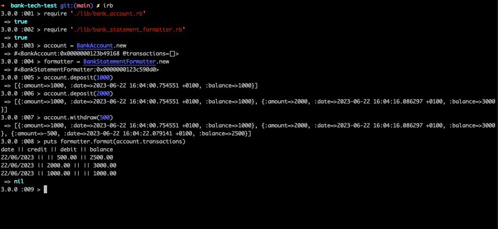

# Bank-Tech-Test

Practice tech test for Maker's Academy. A simple bank account program that allows you to make deposits and withdrawals and will print a statement of all the transactions in your account.
Data does not persist between instances of the program running so your transactions will disappear when you close the REPL.

## Specification

### Requirements

```plain
* You should be able to interact with your code via a REPL like IRB or Node.  (You don't need to implement a command line interface that takes input from STDIN.)
* Deposits, withdrawal.
* Account statement (date, amount, balance) printing.
* Data can be kept in memory (it doesn't need to be stored to a database or anything).
```

### Acceptance criteria

```plain
**Given** a client makes a deposit of 1000 on 10-01-2023  
**And** a deposit of 2000 on 13-01-2023  
**And** a withdrawal of 500 on 14-01-2023  
**When** she prints her bank statement  
**Then** she would see

date || credit || debit || balance
14/01/2023 || || 500.00 || 2500.00
13/01/2023 || 2000.00 || || 3000.00
10/01/2023 || 1000.00 || || 1000.00
```

## Approach

Here is a summary of my approach:
- I started by extracting the necessary features from the spec and using that to design a two-class system. I considered a third Transaction class, but decided it was unnecessary to meet the spec.
### Design
_________

_________
- I tried to adhere to the Single Responsibility Principle (SRP) in my class design by separating the responsibility for the account state and the statement formatting into different classes. Likewise, each method has one responsibility, and, where possible I've tried to encapsulate method logic into private methods so that it is easy to re-use and change.
- I used Test Driven Development, (TDD), to implement my design.

### Modifications

I made a few modifications to this design during the implementation:

- I didn't implement a balance variable as appears in the BankAccount interface, because I decided it was redundant since the transactions already hold the same information. I did, however, implement a get_balance method that returns the sum of the transaction amounts. This is beyond the scope of the specifications, but it felt weird to make a bank account class that couldn't directly tell you its balance, and it re-uses logic that was necessary for meeting the spec, anyway.
- The transaction hash now includes the balance of the account after the transaction is added.

### Observations

- The date parameter in #deposit and #withdraw defaults to the current date/time, but a Time object can also be passed in to mimic the acceptance criteria. This means
  that you could theoretically put in out-of-order transactions that wouldn't properly calculate the account balance, or show up in the right order. If I were to go further with this program, I would control
  user input in a UI class that wouldn't allow custom dates to be passed through to these methods. 
- if I were, to continue this project, I would make the transaction hashes into their own class - that would further separate responsibilities, encapsulate data, and make it easier to implement changes down the line. For example, if you needed to add more information to a transaction, you'd only have to modify the class.

## Example of Program Running
Below is an example of the program running in IRB:
____________

____________
## Installation

In your preferred directory:

```zsh
git clone https://github.com/awdem/bank-tech-test.git
cd bank-tech-test
bundle install
```
### How to run

There is currently no user interface, so you have to interact with the program via irb. To do so, launch irb in your console, then input:

```irb
# the following lines with set up classes for you to test out methods:

require './lib/bank_account.rb'
require './lib/bank_statement_formatter.rb'
account = BankAccount.new
formatter = BankStatementFormatter.new

# You can call deposit and withdraw with a number on account to add transactions to your account. You can call get_balance to return your current balance.
# To see your statement in the console run:

puts formatter.format(account.transactions) 
```
### How to test:

In the project directory:

To run all tests:
```zsh
rspec
```
To list all tests:
```zsh
rspec -f d
```