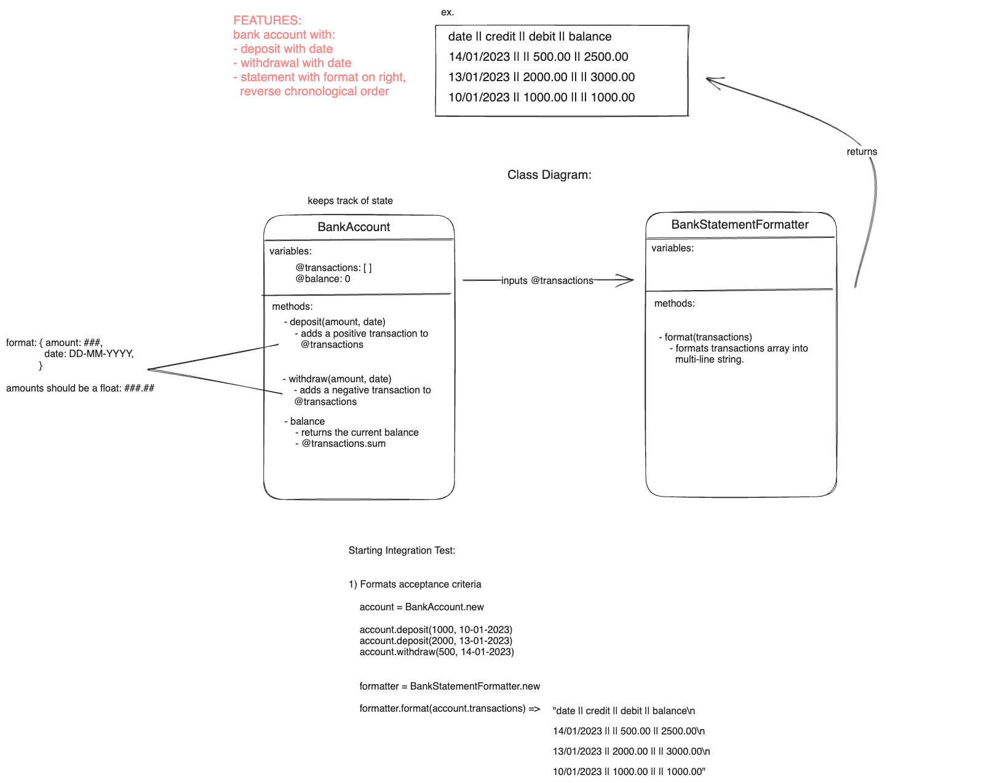

# Bank-Tech-Test

Practice tech test for Maker's Academy. 

## Specification

### Requirements

* You should be able to interact with your code via a REPL like IRB or Node.  (You don't need to implement a command line interface that takes input from STDIN.)
* Deposits, withdrawal.
* Account statement (date, amount, balance) printing.
* Data can be kept in memory (it doesn't need to be stored to a database or anything).

### Acceptance criteria

**Given** a client makes a deposit of 1000 on 10-01-2023  
**And** a deposit of 2000 on 13-01-2023  
**And** a withdrawal of 500 on 14-01-2023  
**When** she prints her bank statement  
**Then** she would see

```
date || credit || debit || balance
14/01/2023 || || 500.00 || 2500.00
13/01/2023 || 2000.00 || || 3000.00
10/01/2023 || 1000.00 || || 1000.00
```

## Design



## How to install

In your preferred directory:

```zsh
git clone https://github.com/awdem/bank-tech-test.git
cd bank-tech-test
bundle install
```
## How to run

There is currently no user interface, so you have to interact with the program via irb. To do so, launch irb in your console, then input:

```irb
# the following commands with set up classes for you to play with:

require './lib/bank_account.rb'
require './lib/bank_statement_formatter.rb'
account = BankAccount.new
formatter = BankStatementFormatter.new

# 
```
## Tests

```zsh
# to run tests
rspec
# to list all tests: 
rspec -f d
```